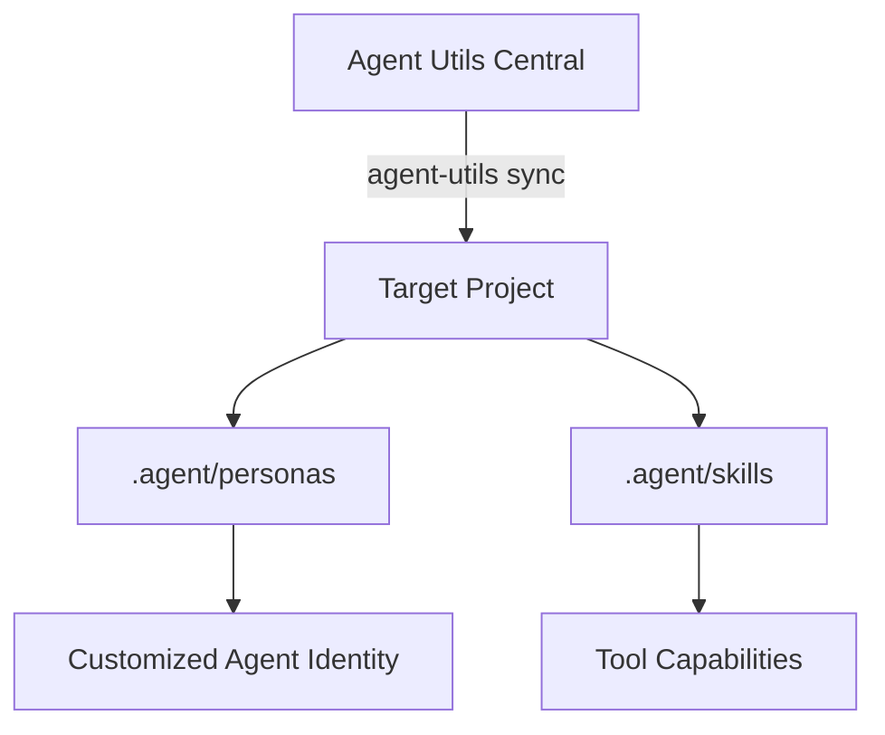

<p align="center">
  
</p>

<h1 align="center">Agent Utils</h1>

<p align="center">
  <a href="#-active-registry"><b>Registry</b></a> •
  <a href="#-directory-structure"><b>Architecture</b></a> •
  <a href="#-installation"><b>Setup</b></a> •
  <a href="#-usage"><b>Usage</b></a>
</p>

<p align="center">
  
  
  
  
</p>

---

### 🚀 The Command Center

This repository is the **central intelligence hub** for all Agent Personas and Skills. It provides a standardized framework for deploying AI agents across multiple projects with a single command.

## 📋 Active Registry

Everything in this section is fully configured and ready for production use.

| Category | Component | Description |
| :--- | :--- | :--- |
| **🤖 Agents** | `staff-engineer.md` | High-level technical strategy and system design. |
| | `security-reviewer.md` | Deep security audit and vulnerability scanning. |
| | `portfolio-manager.md` | specialized Yahoo Finance portfolio tracking. |
| | `human-editor.md` | Refining AI content for human readability. |
| | `resume-expert.md` | Career guidance and resume optimization. |
| | `data-viz-expert.md` | Turning raw data into stunning visualizations. |
| **🛠️ Skills** | `yahoo-finance-browser` | Full browser automation for stock data. |
| | `create-stock-chart` | Dynamic chart generation for financial analysis. |
| **📝 Workflows**| `publish-article` | Automated flow from draft to production. |
| | `sync-to-portfolio` | Real-time synchronization of financial entries. |
| | `commit-msg-gen` | AI-powered semantic git commit generation. |

<details>
<summary><b>🔍 View QA & Testing Suite (5 Active Agents)</b></summary>

*   `api-tester.md`
*   `performance-benchmarker.md`
*   `test-results-analyzer.md`
*   `tool-evaluator.md`
*   `workflow-optimizer.md`
</details>

<details>
<summary><b>🌑 View Inactive/Draft Personas (22 Placeholders)</b></summary>

These personas are currently in "Pending Configuration" mode:
*   `ui-designer.md`, `growth-hacker.md`, `tiktok-strategist.md`, `infrastructure-maintainer.md`, and 18 others.
</details>

---

## 🏗️ Architecture



*   **`agents-studio/personas/`**: Core identity definitions.
*   **`agents-studio/skills/`**: Capability modules (JS/Browser automation).
*   **`agents-studio/workflows/`**: Multi-step SOPs for agents.
*   **`scripts/`**: Sync and maintenance engine.

---

## ⚙️ Setup & Deployment

### 1. Global Installation
```bash
git clone https://github.com/jonathancecilj/agent-utils.git
cd agent-utils
./install.sh
```

### 2. Project Integration (Downstream)
The `import` command helps you select agents and automatically builds your `agent-manifest.json`.
```bash
agent-utils import
```

### 3. Sync & Update
Pull the latest definitions from the central hub into your current project:
```bash
agent-utils sync
```

---

## 🛠️ Contribution Workflow

1.  **Draft Local**: Create a new agent in your project's `.agent/personas/`.
2.  **Validate**: Run `agent-utils validate` to check for drift.
3.  **Promote Upstream**: Run `agent-utils promote` to push your improvements back to this central registry.

<p align="right">(<a href="#-agent-utils">back to top</a>)</p>
